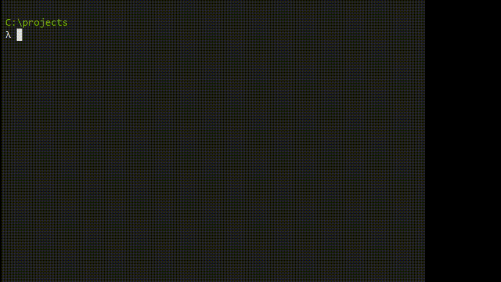
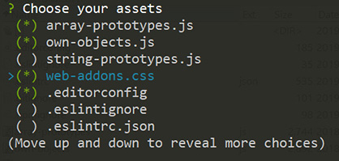

# code-template-generator
[](https://nodejs.org)   [](https://www.npmjs.com/package/code-template-generator/)

## Table of contents
1. [Introduction](#1-introduction)
    * [Screenshot](#screenshot)
2. [Main features](#2-main-features)
    * [Project templates](#21-project-templates)
    * [Component templates](#22-component-templates)
    * [User asset generation](#23-user-asset-generation)
3. [Installation](#3-installation)
4. [Usage](#4-usage)
    * [Options](#41-options)
    * [Sub options](#42-sub-options)
    * [Aliases](#43-aliases)
5. [Examples](#5-examples)
6. [Tips and tricks for the project templates](https://github.com/nguyenkhois/build-environments/blob/master/HOWTO.md)
7. [Thanks you!](#6-thank-you)

## 1. Introduction
The application is a lightweight Node.js CLI tool that is most using for front-end web development with  [React](https://reactjs.org/). Main features:
* Project generation that has a part of the [Build environments](https://github.com/nguyenkhois/build-environments) project.
* Component generation.
* User asset generation.

You build your own and have more choices for your frontend development. It makes your life easier. (^_~)

### Screenshot


## 2. Main features
* Project generation:
    * Without running the `git init` command.
    * With running the `git init` command and generation of a `.gitignore` file while the project is generated from a chosen template.
* React component generation:
    * There are two kinds of generated components: React and React-Redux.
    * It can be:
        * A single React component that is a file `*.js` or `*.jsx`.
        * A full React component that is a directory with two files `*.js` and `*.css` are within.
* `.gitignore` file generation.
* Automatic update checking for the latest stable version.
* [Project templates](https://github.com/nguyenkhois/build-environments):
    * It's simple for configuration and installation of dependencies you need.
        * Work fast and flexible.
        * Only the minimum needed dependencies are installed and preconfigured.
        * Easy to change to (or from) another build environment.
        * Compatibility with another project that is generated from [create-react-app](https://facebook.github.io/create-react-app/).
    * Code splitting.
    * Image handling.
    * Minification for production.
    * CSS, JS code injected automatic into the HTML template `/src/index.html`.
    * Hot Module Replacement (HMR) is enabled.
    * You don't need to care about the distribution directory `/dist`. The things you care are only the directory `/src`.
    * Anti-caching.
* User asset generation -> You can retrieve your own assets from a local directory.

### 2.1 Project templates
|Templates|Main dependencies|
|---|---|
|react-advance|Babel 7, Babel Loader 8, SplitChunksPlugin for code splitting|
|react-hooks|Using React Hooks and it's based on the template react-advance |
|react-sass|Using SASS and it's based on the template react-hooks |
|react-simple|Babel 7, Babel Loader 8|
|react-typescript|TypeScript 3, awesome-typescript-loader|
|simple-express-server|Express, cors|

You can view more details about these project templates in the repository [Build environments](https://github.com/nguyenkhois/build-environments).

### 2.2 Component templates
|Component|Single (*)|Full (**)|Description|
|---|:---:|:---:|---|
|React|✓|✓||
|React-Redux|✓|✓|_You need install and config Redux, React-Redux by yourself._|
|React hooks|✓|✓||

(*) Single component is a file with these supported extension `*.js` or `*.jsx`.

(**) Full component is a directory with two files `*.js` and `*.css` that are generated within.

### 2.3 User asset generation
You can retrieve your own assets from a local directory.



1. Reasons
    * You may have your own libraries, code templates and many more like .gitignore, .editorconfig, .eslinttrc.json, .eslintignore, ect.
    * You don't want to do the same things as search-copy-paste the assets many times while you are coding or starting a new project.
2. Details
    * The options, sub options and their respective aliases:
        * `-cf, --config` is used with its sub options:
            * `--set-asset`
            * `--view-asset`
        * `-m, --my-asset`
    * Syntaxes:
        * `generate -cf --set-asset <local-path-to-your-asset-directory>`
        * `generate -cf --view-asset`
        * `generate -m`

_(You can view [how to use](#4-usage) and the [examples](#5-examples) are below for more details)_

## 3. Installation
`$ npm install --global code-template-generator`

System requirements:
* The minimum supported Node.js version is 8.3.0 (Node.js LTS version is a good choice for the stability).
* Administrator permission is required by your operating system for:
    * Installation of `code-template-generator` on global by the option `--global`.
    * Running the command `$ generate --update` for the latest stable version updating.

## 4. Usage
`$ generate [-option] [--sub-option] [project-name][component-name][path]`

__Tip!__ You can use the command `gen` instead of `generate` in version 2.2.x. It's more quickly when you enter a command line.

Examples:

* `generate --version` -> Main command.
* `gen --version` -> Short command.

### 4.1 Options
| Option | Used with | Description |
|:---:|:---:|---|
| - | `<project-name>` |  Generate a new project from a chosen template without running the `git init` command |
|`-g`|`<project-name>`| Run automatically the `git init` command and generate a `.gitignore` file on the root of project directory during the generation|
|`-c`|`<component-name.js>`|Generate a single React component `(*.js or *.jsx)` in the current directory|
|`-r`|`<component-name.js>`|Generate a single React-Redux component `(*.js or *.jsx)` in the current directory|
|`-h`|`<component-name.js>`|Generate a single React hooks component `(*.js or *.jsx)` in the current directory|
|`-fc`|`<component-name>`|Generate a full React component that is a directory with `*.js, *.css` files in the current directory|
|`-fr`|`<component-name>`|Generate a full React-Redux component that is a directory with `*.js, *.css` files in the current directory|
|`-fh`|`<component-name>`|Generate a full React hooks component that is a directory with `*.js, *.css` files in the current directory|
|`-i`|-| A `.gitignore` file will be generated in the current directory |
|`-v`|-|View the installed version|
|`-help`|-|View help documentation|
|`-u`|-| Automatic update checking and installation for the latest stable version (*) |
|`-cf`| (**) |Using with one of these sub options: `--set-asset`, `--view-asset`|
|`-m`|-|Show a list to retrieve chosen asset(s) into the current work directory|

(*) Administrator permission is required by your operating system. Here are the examples for MacOS and Ubuntu systems by using `sudo`:
* `$ sudo generate -u`
* `$ sudo generate --update` (Using alias)

(**) View how to use with its sub options that are below.

### 4.2 Sub options
* `--no-install` (No install dependencies)
* `--set-asset` (Set a local path to the asset directory)
* `--view-asset` (View the current local path to the asset directory)
* `--jsx`

|Option|Sub option|Used with|Description|
|:---:|:---:|:---:|---|
|-|`--no-install`|`<project-name>`|Generate a project without running the `git init` command and installation of dependencies|
|`-g`|`--no-install`|`<project-name>`|Generate a project with running the `git init` command but without installation of dependencies|
|`-cf`|`--set-asset`|`<local-path>`|Store a local path to the asset directory into the application config file|
|`-cf`|`--view-asset`|-|View the current asset path|
|`-fc`|`--jsx`|`<component-name>`|(*) The application creates a `*.jsx` file instead of a `*.js` file that is default when it generates a full component|
|`-fr`|`--jsx`|`<component-name>`|(*)|
|`-fh`|`--jsx`|`<component-name>`|(*)|

### 4.3 Aliases
|Option|Alias|
|:---:|:---|
|`-g`|`--git`|
|`-c`|`--component`|
|`-r`|`--redux-component`|
|`-h`|`--hooks`|
|`-fc`|`--full-component`|
|`-fr`|`--full-redux-component`|
|`-fh`|`--full-hooks-component`|
|`-i`|`--gitignore`|
|`-v`|`--version`|
|`-help`|`--help`|
|`-u`|`--update`|
|`-cf`|`--config`|
|`-m`|`--my-asset`|

## 5. Examples

````
// Project generation
$ generate first-project             // Without any options
$ generate -g secondproject          // Running the `git init` command
$ generate --git ThirdProject        // Using alias --git instead of -g
$ generate -g --no-install OtherProject
$ generate --no-install LastProject  // No install dependencies

// Single component -> A file
$ generate -c SearchComponent.js   // React component
$ generate -r ReviewComponent.jsx  // React-Redux component
$ generate -h Count.js             // React hooks component

// Full component -> A directory
$ generate -fc ProductComponent
$ generate -fr CartComponent
$ generate -fh Counter
$ generate -fh --jsx Header   // Using *.jsx for a component file

// Asset generation
$ generate -cf --set-asset "C:\Users\name\myassets"  // Windows
$ generate -cf --set-asset "/Users/name/myassets"    // MacOS
$ generate -cf --set-asset "/home/name/myassets"     // Ubuntu
$ generate -cf --view-asset   // View the current asset location
$ generate -m                 // Show the asset list and retrieve them

// Others
$ generate --gitignore  // Generate a .gitignore file
$ generate --version    // View the installed version
$ generate --help       // View help documentation
$ generate --update     // Install the latest stable version
````

## 6. Thank you!
Special thanks to [Harriet Ryder](https://medium.com/northcoders/creating-a-project-generator-with-node-29e13b3cd309)!

Many thanks to [Commander.js](https://github.com/tj/commander.js) for the inspiration.
